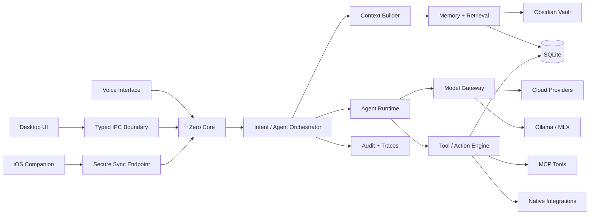

# System Architecture

## Recommended stack

### Desktop

- Electron
- React
- TypeScript
- Vite / electron-vite
- Tailwind CSS + shadcn/ui or a custom design system
- TanStack Router
- TanStack Query for asynchronous UI state
- Zustand for lightweight local UI state
- Monaco Editor for code
- xterm.js + node-pty for terminal

### Local core

- Node.js + TypeScript
- Zod for all boundary validation
- SQLite as primary operational database
- Drizzle ORM or a thin SQL repository layer
- SQLite FTS5 for lexical search
- vector extension or dedicated local vector store behind an interface
- file watcher for Obsidian/workspaces
- worker threads for indexing and embeddings

### Mobile companion

- Swift + SwiftUI
- HealthKit
- background delivery/observer queries where allowed
- encrypted sync payloads

### Optional services

- LiteLLM gateway adapter for provider breadth
- local Ollama
- local MLX-LM server
- remote MCP servers

## Monorepo layout

```text
zero/
  apps/
    desktop/              # Electron + React
    ios-companion/        # SwiftUI HealthKit bridge
  packages/
    core/                 # domain services
    db/                   # schema + repositories
    model-gateway/        # provider/model abstraction
    agents/               # agent runtime + specs
    tools/                # tool registry + executors
    memory/               # indexing/retrieval/graph
    automations/          # triggers, scheduler, workflow engine
    integrations/         # GitHub, Obsidian, calendar, browser...
    protocol/             # IPC/API schemas
    observability/        # traces, costs, audit events
    shared/               # common types/utilities
  docs/
  scripts/
```

## Runtime topology



## Major bounded contexts

### Identity & configuration

Stores profile configuration, preferences, privacy rules, default routing policies, integration metadata, and UI settings.

### Knowledge

Indexes documents, notes, links, facts, entities, relationships, source chunks, and embeddings.

### Work

Projects, tasks, milestones, blockers, decisions, sessions, repositories, and work logs.

### Conversation

Threads, messages, context attachments, model invocations, citations, and tool calls.

### Agents

Agent definitions, runs, steps, plans, outputs, escalations, and evaluations.

### Actions

Tool definitions, permissions, approvals, executions, rollback metadata, and audit receipts.

### Automations

Triggers, workflows, schedules, runs, retries, and notifications.

### Health

Authorized metric definitions, normalized samples/aggregates, sync metadata, and privacy policy.

### Content

Ideas, source notes, drafts, platform variants, editorial decisions, and performance notes if later connected.

## Design rule: no provider-specific types in domain code

Provider SDK objects must terminate inside `model-gateway`. Domain code receives normalized objects such as:

```ts
interface ModelRequest {
  modelRef: string;
  messages: ZeroMessage[];
  tools?: ToolDefinition[];
  responseSchema?: JsonSchema;
  reasoning?: ReasoningPolicy;
  attachments?: AttachmentRef[];
  stream?: boolean;
}

interface ModelResponse {
  text: string;
  reasoningSummary?: string;
  toolCalls: NormalizedToolCall[];
  usage?: TokenUsage;
  finishReason: FinishReason;
  rawProviderRef?: string;
}
```

## Design rule: action execution is deterministic code

The LLM proposes a tool call. Zero validates and executes it. The model never directly receives unrestricted shell or filesystem access.

## Design rule: source objects are immutable references

A retrieved context item uses a stable source ID. Answers cite source IDs that the UI resolves to notes, commits, files, web sources, tasks, or prior decisions.

## Process separation

Electron renderer must not have Node privileges. Use:

- sandboxed renderer;
- context isolation;
- narrow preload bridge;
- schema-validated IPC;
- no generic `exec` exposed to the renderer.

Privileged operations live in the main/core process and require explicit tool contracts.

## Deployment modes

### Local-only

- all persistent data local;
- local model only;
- no remote retrieval.

### Hybrid private

- data local;
- selected prompts sent to configured cloud providers;
- sensitive scopes can force local routing.

### Connected

- remote model providers;
- remote MCP/integrations;
- optional encrypted sync for mobile companion.

The same codebase should support all three without changing data ownership.
