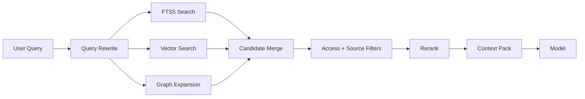

# Memory, Obsidian & Knowledge Graph

## Core idea

Obsidian is a durable, human-owned knowledge source. Zero builds an **operational memory layer** over it rather than replacing it.

## Memory layers

### Layer 0 — raw sources

Immutable or source-owned material:

- Obsidian Markdown;
- local documents;
- code/repositories;
- Git commits;
- tasks;
- calendar events;
- health aggregates;
- research sources;
- content drafts;
- conversation transcripts.

### Layer 1 — searchable chunks

Normalized text chunks with:

- source ID;
- offsets/headings;
- timestamps;
- lexical index;
- embedding;
- source type;
- access classification.

### Layer 2 — entities and graph

Entities such as:

- Person
- Project
- Product
- Organization
- Topic
- Skill
- Goal
- Decision
- Repository
- Task
- Event
- Document

Relationships include:

- `works_on`
- `depends_on`
- `decided_in`
- `mentioned_in`
- `related_to`
- `blocked_by`
- `authored`
- `committed_to`
- `derived_from`
- `supersedes`

### Layer 3 — durable facts

Atomic statements with provenance:

```ts
interface Fact {
  id: string;
  subjectEntityId: string;
  predicate: string;
  value: JsonValue;
  sourceIds: string[];
  confidence: number;
  status: 'candidate' | 'accepted' | 'superseded' | 'rejected';
  validFrom?: string;
  validTo?: string;
}
```

### Layer 4 — episodic memory

A timeline of meaningful events:

- completed task;
- project milestone;
- decision;
- coding session;
- research conclusion;
- agent action;
- major note update.

### Layer 5 — working memory

Short-lived state for an active conversation or task. It expires or is compacted.

## Obsidian ingestion

### Watch the vault directly

For desktop v1, do not require an Obsidian plugin. Observe filesystem changes and parse Markdown.

Extract:

- title;
- path;
- headings;
- frontmatter/properties;
- tags;
- wikilinks;
- markdown links;
- block IDs when present;
- task syntax if desired;
- created/modified timestamps.

### Optional Obsidian plugin later

Add a plugin only when Zero needs richer bidirectional commands such as:

- insert a decision block at cursor;
- show Zero citations in Obsidian;
- capture selected text to a project;
- expose custom commands.

## Canonical note schemas

Recommend standardized frontmatter for high-value note types.

### Project

```yaml
type: project
status: active
aliases: []
repo: ''
priority: high
started: 2026-08-01
```

### Decision

```yaml
type: decision
project: '[[Project Name]]'
status: accepted
decided: 2026-08-08
supersedes: ''
```

### Person

```yaml
type: person
relationship: ''
last_reviewed: 2026-08-08
```

Do not force the whole vault into strict schemas. Structured note types are optional accelerators.

## Retrieval pipeline



Suggested score components:

- semantic relevance;
- keyword relevance;
- graph distance;
- recency;
- source authority;
- project scope match;
- explicit user pinning.

## Context packs

Never send raw database rows. Create a typed context pack:

```ts
interface ContextPack {
  query: string;
  scope: ScopeDescriptor;
  sources: ContextSource[];
  knownFacts: Fact[];
  recentEvents: EpisodicEvent[];
  tokenBudget: number;
}
```

## Memory write policy

### Auto-write allowed

Low-risk operational facts such as:

- task completed;
- commit observed;
- file changed;
- agent run result;
- project last active time.

### Candidate memory

Inferred durable personal facts should be staged as candidates. The Memory Curator can merge duplicates, detect conflicts, and ask for confirmation when a fact is ambiguous or sensitive.

### Source precedence

Recommended precedence:

1. explicit user correction;
2. user-authored structured note;
3. system-of-record integration;
4. observed event;
5. agent inference.

## Contradiction handling

Do not overwrite conflicting facts silently. Store both with validity and provenance, then mark the older/superseded fact when resolved.

## Graph UI

The graph should be useful, not decorative. Support:

- project-focused subgraph;
- person/project relationships;
- decision lineage;
- “why is this related?” explanation;
- time filter;
- source-type filter;
- click-through to exact evidence.
