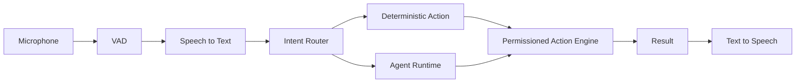

# Voice Assistant — Voice to Action

## Product requirement

Voice is not a separate “chatbot.” It is a low-friction transport into the same intent, agent, context, and action system used by text.

## V1 interaction model

Start with **push-to-talk**. It is simpler, more private, easier to debug, and avoids continuous microphone complexity.

Pipeline:

## Speech-to-text providers

Create a speech provider interface just like the LLM interface.

Possible lanes:

- Apple/native speech where appropriate;
- local Whisper-compatible implementation;
- optional remote STT provider.

The voice system should work even if the main reasoning model is Claude, Kimi, GLM, or another provider.

## TTS

Default to system TTS for simplicity and privacy. Add cloud voices as optional provider adapters later.

## Intent first

Do not send every voice command to an expensive frontier model.

Examples of deterministic intents:

- create task;
- mark task done;
- open project;
- show recent commits;
- start focus session;
- search notes;
- open coding workspace.

Use an LLM only when extraction or planning is ambiguous.

## Action confirmation examples

### Low risk

“Add a task to Project X: benchmark sync layer tomorrow.”

If `task.create` auto-approval is enabled, execute and answer with a short confirmation.

### External side effect

“Post this to X.”

Create the final draft, read/show a concise preview, and require confirmation before publishing if publishing is ever enabled.

### Destructive

“Delete the project folder.”

Require explicit confirmation with exact path and impact. Prefer moving to Trash when possible rather than permanent deletion.

## Interruptions and correction

Voice UI needs:

- cancel command;
- “no, change X to Y” correction;
- stop speaking;
- show transcription before risky action;
- easy fallback to text.

## Wake phrase — later phase

A customizable wake phrase can be added after v1. Keep wake detection on-device and separate from cloud transcription. If the project becomes a public product, use an original product identity instead of depending on a film-associated assistant name.

## Voice context

Voice commands may inherit the active UI scope:

- current project;
- current repository;
- current note;
- current conversation.

The UI must show the inherited scope so “add a task for this” is not ambiguous.
