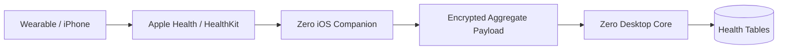

# Integrations

## Integration architecture

Every integration implements a consistent lifecycle:

```ts
interface Integration {
  id: string;
  connect(): Promise<void>;
  disconnect(): Promise<void>;
  status(): Promise<IntegrationStatus>;
  sync(cursor?: string): Promise<SyncResult>;
  tools(): ToolDefinition[];
}
```

Credentials are references to secrets in Keychain.

## Obsidian

### V1

- user selects vault folder;
- filesystem watcher indexes Markdown changes;
- parse links/properties/tags;
- open source note using file path or Obsidian URI;
- write only through explicit Zero tools.

### Later

Optional Obsidian plugin for in-editor commands and richer event hooks.

## Git + GitHub

### Local Git first

Use the local repository for:

- recent commits;
- branches;
- diff;
- status;
- authorship;
- working tree changes.

This works offline and avoids unnecessary API calls.

### GitHub integration

Use GitHub APIs for remote-only information such as:

- pull requests;
- issues;
- actions/checks;
- remote repository metadata;
- activity not present locally.

GitHub’s REST API provides commit and repository endpoints suitable for the project dashboard.

## HealthKit + iOS companion

Apple HealthKit is the correct source-of-truth integration layer for Apple ecosystem health data. HealthKit requires explicit user permission for each relevant data type.

### Architecture



### Store normalized daily aggregates first

Start with user-approved metrics such as:

- steps;
- active energy;
- exercise duration;
- sleep duration/stages when available;
- resting heart rate if user enables it;
- workouts.

Avoid copying every raw sample unless a feature requires it.

### NoiseFit

Noise’s current privacy information indicates that, where supported, the NoiseFit app can transfer information to services including Apple Health. No stable public developer API was identified in the official material reviewed for this blueprint.

Therefore the implementation priority is:

1. NoiseFit/watch → Apple Health when supported by the user’s device/app;
2. Zero iOS companion → HealthKit;
3. only build a direct NoiseFit connector if Noise publishes a supported developer API later.

Do not reverse-engineer a private wearable API for the core product.

## Calendar

Interface:

- read events;
- free/busy summary;
- create/update event as a permissioned action.

Keep provider adapters separate: Apple EventKit for native companion or Google/Microsoft connectors as needed.

## Email

Initial scope:

- search/read when explicitly connected;
- draft responses;
- send only with confirmation.

Do not let a research document or webpage instruct the email tool to send something.

## Browser & web research

Separate:

- search API/tool;
- HTTP page extraction;
- interactive browser.

The Research Agent records source URL, title, retrieved date, publisher/domain, and source snapshot metadata.

## Social/content platforms

V1 should stop at drafts and content planning. The product can later add publishing connectors with explicit approvals and platform-specific compliance.

## Local files

Use scoped roots:

- Obsidian vault;
- registered project workspaces;
- user-approved import folders.

Never assume the agent may recursively read the entire home directory.
